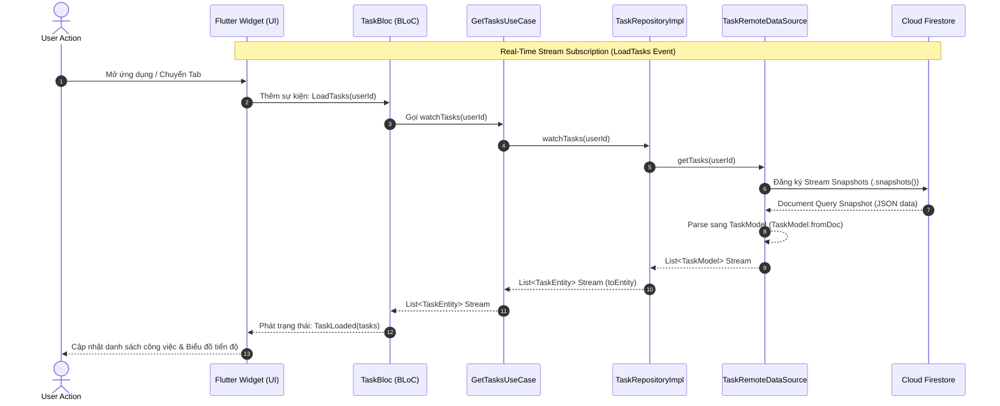

# 📝 Task Manager Application (Personal Productivity Optimizer)

Một ứng dụng Flutter & Firebase quản lý công việc cá nhân, được thiết kế theo tiêu chuẩn **Clean Architecture** và mô hình quản lý trạng thái **Flutter BLoC**. Dự án không chỉ là một danh sách kiểm tra (to-do list) thông thường, mà là một **hệ thống tối ưu hóa năng suất cá nhân (Personal Productivity Optimizer)** tích hợp biểu đồ phân tích và thông báo nhắc nhở thông minh.

👉 **Trải nghiệm ứng dụng thực tế (Live Demo):** [TaskManager Web App](https://taskmanager-ng0604.web.app)  
*(Lưu ý: Để có trải nghiệm tốt nhất trên máy tính, vui lòng kích hoạt chế độ Responsive / Mobile View trên trình duyệt)*

---


## 🏗 Kiến Trúc Hệ Thống (Clean Architecture)

Dự án tuân thủ nghiêm ngặt nguyên lý **Clean Architecture** để đảm bảo code dễ bảo trì, dễ mở rộng và dễ kiểm thử độc lập:

```
lib/
├── const/              # Theme, màu sắc, tài nguyên dùng chung
├── core/               # Các dịch vụ hệ thống (Notification, Image Picker, v.v.)
├── data/               # Tầng dữ liệu (Models, Repositories Implementation, DataSources)
│   ├── datasources/    # Gọi trực tiếp Firebase Auth, Cloud Firestore, Firebase Storage
│   ├── models/         # Parsing JSON/Snapshot & mapping sang Domain Entities
│   └── repositories/   # Triển khai cụ thể các hợp đồng repository
├── domain/             # Tầng nghiệp vụ (Entities, Usecases, Repository Contracts)
│   ├── entity/         # Các đối tượng nghiệp vụ thuần Dart (Task, User, Category)
│   ├── repositories/   # Giao diện trừu tượng (Interface) định nghĩa các nghiệp vụ
│   └── usecases/       # Các ca sử dụng đơn trách nhiệm (Single Responsibility UseCases)
└── presentation/       # Tầng hiển thị (UI & State Management)
    ├── blocs/          # Xử lý Logic & luồng trạng thái (Auth, Task, Category, Theme)
    └── pages/          # Giao diện Widgets (AuthGate, HomePage, ProfilePage, v.v.)
```

---

## 🔄 Luồng Dữ Liệu Phản Hồi (Reactive Data Flow)

Ứng dụng sử dụng cơ chế **Reactive Streams** từ Firebase Firestore giúp đồng bộ dữ liệu tức thì đến giao diện người dùng mà không cần tải lại trang:



---

## 🚀 Tính Năng Chính 
Ứng dụng đáp ứng đầy đủ các tiêu chuẩn của một sản phẩm chất lượng cao:

*   **Xác Thực & Phân Quyền (Authentication & Authorization):**
    *   Đăng ký, đăng nhập bảo mật và khôi phục mật khẩu thông qua Firebase Authentication.
    *   **Bảo mật dữ liệu nhiều khách thuê (Multi-tenant Data Isolation):** Dữ liệu công việc được cô lập tuyệt đối dựa trên UID của người dùng đăng nhập tại tầng DataSource, đảm bảo User A không bao giờ truy cập được dữ liệu của User B.
*   **Nghiệp Vụ CRUD Thời Gian Thực:**
    *   Thêm mới, cập nhật, xóa công việc và quản lý danh mục (Category) tùy chỉnh.
    *   Lọc công việc thông minh theo ngày (Hôm nay, Ngày mai) hoặc theo danh mục tương ứng.
*   **Xử Lý Trạng Thái & Lỗi Hệ Thống:**
    *   Tách biệt rõ ràng các trạng thái `Loading` (màn hình chờ), `Success` (hiển thị dữ liệu), `Empty` (danh sách trống), và `Error` (kết nối lỗi).
    *   Form-validation nghiêm ngặt (kiểm tra định dạng Email, mật khẩu mạnh từ 6 ký tự, tên công việc không trống).
    *   Bắt và xử lý ngoại lệ (Exception) tập trung tại BLoC và hiển thị thông báo thân thiện (SnackBar) cho người dùng.
*   **Nhắc Nhở Proactive:**
    *   Tích hợp hệ thống Local Notification tự động lập lịch báo thức nhắc nhở khi tạo/sửa đổi lịch trình công việc và hủy nhắc nhở khi công việc hoàn thành.

---

## 🎨 Chi Tiết Nâng Cấp Giao Diện UI/UX Cao Cấp (Premium Upgrades)

Toàn bộ hệ thống giao diện đã được thiết kế lại theo phong cách hiện đại, trực quan sinh động và đạt chuẩn mỹ thuật số cực kỳ cao cấp:

### 1. Hệ Màu sắc & Chủ Đề Đồng Bộ (Material Themes)
*   **Light Mode**: Màu nền Slate dịu mát (`#F8FAFC`) kết hợp sắc màu Violet/Indigo chủ đạo mang lại cảm giác năng động và tươi trẻ.
*   **Dark Mode (Obsidian Mode)**: Nền tối sâu thẳm siêu thực (`#090D16`) kết hợp cùng các thẻ hộp xám Slate đậm (`#151C2C`) hạn chế tối đa mỏi mắt và tăng độ nổi bật cho biểu đồ.

### 2. Luồng Xác Thực Thủy Tinh Mờ (Glassmorphism Auth Flow)
*   Màn hình Đăng nhập & Đăng ký sử dụng nền gradient chuyển tiếp ba màu sắc thời thượng.
*   Form nhập liệu được bọc trong khung **Glassmorphism mờ** mềm mại với hiệu ứng mờ nhòe hậu cảnh (Backdrop Filter Blur), bo góc tinh tế `24px` cùng hiệu ứng viền phát sáng Indigo khi được chọn.
*   *Sửa lỗi nghiệp vụ*: Bổ sung trường nhập **Username** vào form Đăng ký để đồng nhất dữ liệu Firestore ngay khi kích hoạt tài khoản.

### 3. Vỏ Bọc Điều Hướng Nổi (Floating Navigation Dock)
*   Thanh điều hướng chuyển đổi thành dạng **Floating Dock** bo cong tròn `24px`, nằm lơ lửng trên màn hình nền với đổ bóng mịn màng.
*   Ngăn kéo sidebar (Drawer) nâng cấp với header dải màu gradient tím quyến rũ, viền ảnh đại diện phát sáng trắng và highlight danh mục menu hiện đại.

### 4. Đồ Thị Donut Neon & Sliding Pill Tab Switcher
*   **Biểu đồ Tiến độ Tổng thể**: Nâng cấp thành dạng **Donut Chart** mảnh dẻ, dải màu rực rỡ thu hút thị giác.
    *   *Chế độ sáng*: Cung màu trắng/đen thanh lịch trên nền thẻ gradient tím-indigo.
    *   *Chế độ tối (Obsidian)*: Thẻ tiến độ chuyển sắc deep space sâu lắng (`#1E1B4B` - `#0F172A`), các cung đồ thị phát sáng bằng dải màu **Neon rực rỡ**: **Neon Mint Green** (Hoàn thành), **Electric Cyan** (Cần làm) và **Fiery Coral Red** (Bỏ lỡ).
*   **Sliding Pill Tab Switcher**: Bộ nút lọc ngày (Hôm nay/Ngày mai) dạng viên thuốc trượt mượt mà có hiệu ứng hoạt họa êm ái khi chạm chuyển tab.

### 5. Thẻ Công Việc Đồng Nhất (Modular TaskCard)
*   Tạo mới widget `TaskCard` dùng chung cho tất cả màn hình danh sách, tích hợp viền lề trái tự động đổi màu tương ứng từng phân loại Category (Work, Sport, Family...).
*   Checkbox tròn chuyển màu mượt mà, chạm vào tự động đồng bộ trạng thái đến Firebase và gạch ngang chữ kèm hiệu ứng mờ nhạt dần.

### 6. Trang Thiết Lập Cá Nhân Cao Cấp (End-to-End Clean Architecture)
*   **Đổi Tên Hai Chế Độ (Dual-mode Edit)**: Ở chế độ xem, tên hiển thị dạng chữ to, đậm nét (`22px`). Click vào biểu tượng bút chì phát sáng sẽ mở ra khung nhập liệu TextFormField cùng bộ đôi nút **Cancel (Hủy)** và **Save (Lưu)** chuyển sắc. Tự động thu gọn về dạng xem khi cập nhật thành công.
*   **Bảo vệ Trạng thái Đăng nhập**: Đồng bộ Firestore bằng phương thức `.set(..., SetOptions(merge: true))` tránh tuyệt đối lỗi `NOT_FOUND` và cấu hình BLoC không phát ra `AuthError` gây tự động đăng xuất nhầm khi đổi tên/ảnh đại diện.
*   **Thẻ Cài Đặt Nhắc Nhở Thông Minh**: Hộp cài đặt thông báo bo góc `20px` với biểu tượng chuông đổi trạng thái phát sáng và nút gạt **Switch** tự động quét kiểm tra quyền hệ thống thực tế của thiết bị ảo ngay khi khởi động (`initState`), mang lại SnackBar hướng dẫn thân thiện nhất.

---

## 🛠 Công Nghệ Sử Dụng (Tech Stack)

*   **Language:** Dart (Null Safety)
*   **Framework:** Flutter (Web & Mobile)
*   **State Management:** Flutter BLoC (v8.1.3+)
*   **Backend & DB:** Firebase Auth, Cloud Firestore, Firebase Storage
*   **Charting:** FL Chart (Biểu đồ năng suất)
*   **Notifications:** Flutter Local Notifications (Nhắc nhở tự động)

---

## ⚙️ Hướng Dẫn Cài Đặt & Chạy Local

Để chạy thử nghiệm dự án trên thiết bị cá nhân:

1.  **Clone repository:**
    ```bash
    git clone https://github.com/ng0604/task_managerment.git
    cd task_managerment
    ```
2.  **Cài đặt các gói phụ thuộc:**
    ```bash
    flutter pub get
    ```
3.  **Liên kết cấu hình Firebase:**
    *   Chạy lệnh cấu hình tự động: `flutterfire configure`
    *   Hoặc tải và chèn tệp `google-services.json` vào thư mục `android/app/` và `GoogleService-Info.plist` vào `ios/Runner/`.
4.  **Chạy ứng dụng:**
    ```bash
    flutter run
    ```