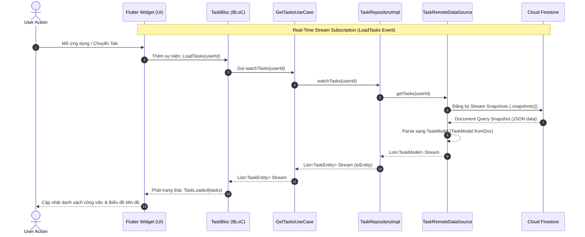

# 📝 Task Manager Application (Personal Productivity Optimizer)

Một ứng dụng Flutter & Firebase quản lý công việc cá nhân, được thiết kế theo tiêu chuẩn **Clean Architecture** và mô hình quản lý trạng thái **Flutter BLoC**. Dự án không chỉ là một danh sách kiểm tra (to-do list) thông thường, mà là một **hệ thống tối ưu hóa năng suất cá nhân (Personal Productivity Optimizer)** tích hợp biểu đồ phân tích và thông báo nhắc nhở thông minh.

👉 **Trải nghiệm ứng dụng thực tế (Live Demo):** [TaskManager Web App](https://taskmanager-ng0604.web.app)  
*(Lưu ý: Để có trải nghiệm tốt nhất trên máy tính, vui lòng kích hoạt chế độ Responsive / Mobile View trên trình duyệt)*

---

## 🎨 Điểm Nổi Bật & Triết Lý Thiết Kế (Aesthetics & UX)

*   **Premium Visual Design:** Giao diện tối giản hiện đại (Modern Minimalist UI) kết hợp bộ màu sắc HSL hài hòa (Teal, Orange, Emerald), tạo trải nghiệm thoải mái cho người dùng.
*   **Dynamic Theme Adaptive:** Tự động chuyển đổi mượt mà giữa Chế độ sáng (Light Mode) và Chế độ tối (Dark Mode) để bảo vệ mắt.
*   **Gamified Productivity Analytics:** Trực quan hóa tiến độ công việc hàng ngày bằng biểu đồ tròn và thanh tiến trình tương tác (`fl_chart`).
*   **Micro-interactions:** Hiệu ứng hover nhạy bén, các hộp thoại cảnh báo và phản hồi trạng thái (Loading, Success, Empty, Error) mượt mà.

---

## 🏗 Kiến Trúc Hệ Thống (Clean Architecture)

Dự án tuân thủ nghiêm ngặt nguyên lý **Clean Architecture** để đảm bảo code dễ bảo trì, dễ mở rộng và dễ kiểm thử độc lập:

```
lib/
├── const/              # Theme, màu sắc, tài nguyên dùng chung
├── core/               # Các dịch vụ hệ thống (Notification, Image Picker, v.v.)
├── data/               # Tầng dữ liệu (Models, Repositories Implementation, DataSources)
│   ├── datasources/    # Gọi trực tiếp Firebase Auth, Cloud Firestore, Firebase Storage
│   ├── models/         # Parsing JSON/Snapshot & mapping sang Domain Entities
│   └── repositories/   # Triển khai cụ thể các hợp đồng repository
├── domain/             # Tầng nghiệp vụ (Entities, Usecases, Repository Contracts)
│   ├── entity/         # Các đối tượng nghiệp vụ thuần Dart (Task, User, Category)
│   ├── repositories/   # Giao diện trừu tượng (Interface) định nghĩa các nghiệp vụ
│   └── usecases/       # Các ca sử dụng đơn trách nhiệm (Single Responsibility UseCases)
└── presentation/       # Tầng hiển thị (UI & State Management)
    ├── blocs/          # Xử lý Logic & luồng trạng thái (Auth, Task, Category, Theme)
    └── pages/          # Giao diện Widgets (AuthGate, HomePage, ProfilePage, v.v.)
```

---

## 🔄 Luồng Dữ Liệu Phản Hồi (Reactive Data Flow)

Ứng dụng sử dụng cơ chế **Reactive Streams** từ Firebase Firestore giúp đồng bộ dữ liệu tức thì đến giao diện người dùng mà không cần tải lại trang:



---

## 🚀 Tính Năng Chính Được Kiểm Chứng

Ứng dụng đáp ứng đầy đủ các tiêu chuẩn của một sản phẩm chất lượng cao:

*   **Xác Thực & Phân Quyền (Authentication & Authorization):**
    *   Đăng ký, đăng nhập bảo mật và khôi phục mật khẩu thông qua Firebase Authentication.
    *   **Bảo mật dữ liệu nhiều khách thuê (Multi-tenant Data Isolation):** Dữ liệu công việc được cô lập tuyệt đối dựa trên UID của người dùng đăng nhập tại tầng DataSource, đảm bảo User A không bao giờ truy cập được dữ liệu của User B.
*   **Nghiệp Vụ CRUD Thời Gian Thực:**
    *   Thêm mới, cập nhật, xóa công việc và quản lý danh mục (Category) tùy chỉnh.
    *   Lọc công việc thông minh theo ngày (Hôm nay, Ngày mai) hoặc theo danh mục tương ứng.
*   **Xử Lý Trạng Thái & Lỗi Hệ Thống:**
    *   Tách biệt rõ ràng các trạng thái `Loading` (màn hình chờ), `Success` (hiển thị dữ liệu), `Empty` (danh sách trống), và `Error` (kết nối lỗi).
    *   Form-validation nghiêm ngặt (kiểm tra định dạng Email, mật khẩu mạnh từ 6 ký tự, tên công việc không trống).
    *   Bắt và xử lý ngoại lệ (Exception) tập trung tại BLoC và hiển thị thông báo thân thiện (SnackBar) cho người dùng.
*   **Nhắc Nhở Proactive:**
    *   Tích hợp hệ thống Local Notification tự động lập lịch báo thức nhắc nhở khi tạo/sửa đổi lịch trình công việc và hủy nhắc nhở khi công việc hoàn thành.

---

## 🛠 Công Nghệ Sử Dụng (Tech Stack)

*   **Language:** Dart 3.x (Null Safety)
*   **Framework:** Flutter (Web & Mobile)
*   **State Management:** Flutter BLoC (v8.1.3+)
*   **Backend & DB:** Firebase Auth, Cloud Firestore, Firebase Storage
*   **Charting:** FL Chart (Biểu đồ năng suất)
*   **Notifications:** Flutter Local Notifications (Nhắc nhở tự động)

---

## ⚙️ Hướng Dẫn Cài Đặt & Chạy Local

Để chạy thử nghiệm dự án trên thiết bị cá nhân:

1.  **Clone repository:**
    ```bash
    git clone https://github.com/ng0604/task_managerment.git
    cd task_managerment
    ```
2.  **Cài đặt các gói phụ thuộc:**
    ```bash
    flutter pub get
    ```
3.  **Liên kết cấu hình Firebase:**
    *   Chạy lệnh cấu hình tự động: `flutterfire configure`
    *   Hoặc tải và chèn tệp `google-services.json` vào thư mục `android/app/` và `GoogleService-Info.plist` vào `ios/Runner/`.
4.  **Chạy ứng dụng:**
    ```bash
    flutter run
    ```